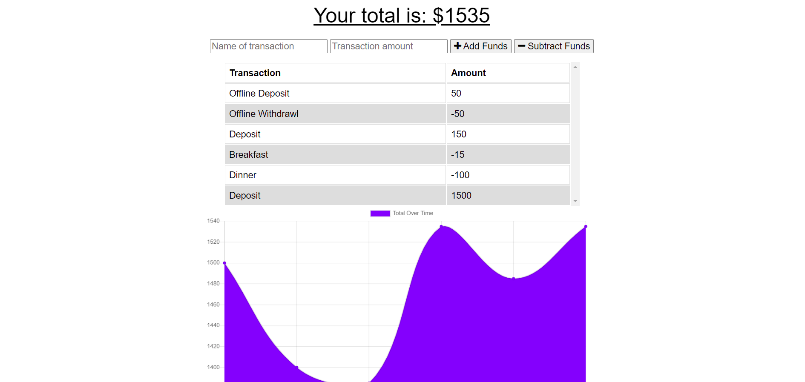

# Budget Tracker

## Description

Application that will allow a user to keep track of their budget.  Should provide user with the ability to add money via a depost or remove money via a withdrawl.  App makes use of PWA features to allow offline functionality and record offline transactions to be loaded at next connection.

Deployed Site: [https://budget-tracker-1234.herokuapp.com/](https://budget-tracker-1234.herokuapp.com)
Site Repository: [https://github.com/Udunomancer/gt-ft-budget-tracker](https://github.com/Udunomancer/gt-ft-budget-tracker)

## Table of Contents
* [Installation](#installation)
* [Usage](#usage)
* [License](#license)
* [Contributing](#contributing)
* [Tests](#tests)
* [Questions](#questions)

##  Installation

* Fork from the GitHub Repository: [https://github.com/Udunomancer/gt-ft-budget-tracker](https://github.com/Udunomancer/gt-ft-budget-tracker)
* Ensure that node is available on device
* Install packages, and configure local MongoDB to support local deployment
* Create Heroku application
* Create MongoDB cluster, and link user/database to Heroku using env variable
* Push files to Heroku application

##  Usage

* A user should be able to view the application by navigating to [https://budget-tracker-1234.herokuapp.com/](https://budget-tracker-1234.herokuapp.com)
    * A user should be able to enter information about a transaction (transaction name and transaction amount) via two fiels on this page.
    * When a user clicks "Add Funds", the values in these fields should be added as a new deposit transaction
    * When a user clicks "Subtract Funds", the values in these fields should be added as a new withdrawl transaction
* For either transaction type:
    * The transaction should be added to the transaction table and graph on the page
    * The transaction should be added to the MongoDB table
* With PWA functionality, the application should function even if the page is offline
    * The user should be able to view all transactions from the last connection
    * The user should be able to add new transactions
    * These transactions should load to the MongoDB database at next available connection

##  License

[The MIT License](https://opensource.org/licenses/MIT)

##  Contributing

No public contributions accepted in this repository at this time.
If issues are found, please contact me using email/GitHub profile found in the Questions section below.

##  Tests

To confirm functionality, deploy site and:
* Confirm that new transactions can be entered on the page, and that they appear on the page and in database
* Confirm that page will load when offline
* Confirm that data is cached when offline
* Confirm that a transaction can be entered when offline
* Confirm that, upon re-connection, offline transactions are loaded to the database

##  Questions

Have questions?
* View my GitHub Profile: [https://github.com/Udunomancer](https://github.com/Udunomancer)
* Email me at: [kyle717@gmail.com](mailto:kyle717@gmail.com)